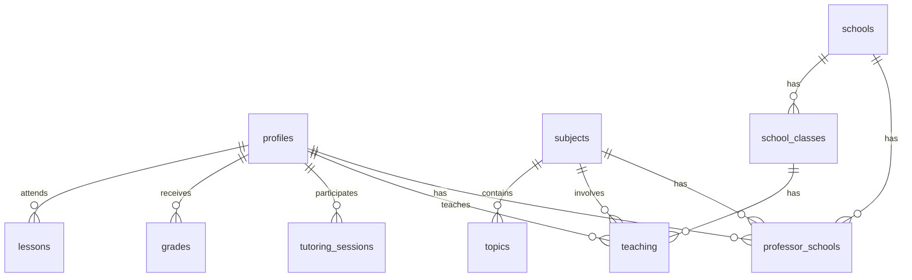

# Struktura Baze Podataka

## Osnovne Tablice

### profiles
Tablica za korisnike sistema.

| Kolona | Tip | Obavezno | Opis |
|--------|-----|----------|------|
| id | uuid | DA | Primarni ključ (auth.users.id) |
| first_name | text | DA | Ime |
| last_name | text | DA | Prezime |
| email | text | DA | Email adresa |
| phone | text | NE | Broj telefona |
| role | text | DA | Uloga korisnika |
| parent_names | text | NE | Imena roditelja (za učenike) |
| parent_phone | text | NE | Telefon roditelja (za učenike) |
| subject | text | NE | Predmet (za profesore) |
| school | text | NE | Škola (za profesore) |
| grades | text[] | NE | Ocjene |
| created_at | timestamp | DA | Vrijeme kreiranja |
| updated_at | timestamp | DA | Vrijeme ažuriranja |

### schools
Tablica za škole u sistemu.

| Kolona | Tip | Obavezno | Opis |
|--------|-----|----------|------|
| id | uuid | DA | Primarni ključ |
| name | text | DA | Naziv škole |
| address | text | NE | Adresa škole |
| created_at | timestamp | DA | Vrijeme kreiranja |
| updated_at | timestamp | DA | Vrijeme ažuriranja |

### school_classes
Tablica za razrede u školama.

| Kolona | Tip | Obavezno | Opis |
|--------|-----|----------|------|
| id | uuid | DA | Primarni ključ |
| name | text | DA | Naziv razreda |
| school_id | uuid | DA | ID škole (FK) |
| created_at | timestamp | DA | Vrijeme kreiranja |

### subjects
Tablica za predmete.

| Kolona | Tip | Obavezno | Opis |
|--------|-----|----------|------|
| id | uuid | DA | Primarni ključ |
| name | text | DA | Naziv predmeta |
| description | text | NE | Opis predmeta |
| created_at | timestamp | DA | Vrijeme kreiranja |

### teaching
Tablica koja povezuje profesore, predmete i razrede.

| Kolona | Tip | Obavezno | Opis |
|--------|-----|----------|------|
| id | uuid | DA | Primarni ključ |
| class_id | uuid | DA | ID razreda (FK) |
| subject_id | uuid | DA | ID predmeta (FK) |
| professor_id | uuid | DA | ID profesora (FK) |
| created_at | timestamp | DA | Vrijeme kreiranja |

## Dodatne Tablice

### topics
Tablica za teme predmeta.

| Kolona | Tip | Obavezno | Opis |
|--------|-----|----------|------|
| id | uuid | DA | Primarni ključ |
| subject_id | uuid | DA | ID predmeta (FK) |
| name | text | DA | Naziv teme |
| difficulty_level | text | NE | Nivo težine |
| prerequisites | jsonb | NE | Preduslovi |
| is_current_in_school | bool | NE | Trenutno u školi |
| created_at | timestamp | DA | Vrijeme kreiranja |
| updated_at | timestamp | DA | Vrijeme ažuriranja |

### lessons
Tablica za časove.

| Kolona | Tip | Obavezno | Opis |
|--------|-----|----------|------|
| id | uuid | DA | Primarni ključ |
| professor_id | uuid | DA | ID profesora (FK) |
| student_id | uuid | DA | ID učenika (FK) |
| subject | text | DA | Predmet |
| date | date | DA | Datum |
| start_time | time | DA | Vrijeme početka |
| end_time | time | DA | Vrijeme završetka |
| status | text | DA | Status časa |
| notes | text | NE | Bilješke |
| created_at | timestamp | DA | Vrijeme kreiranja |
| updated_at | timestamp | DA | Vrijeme ažuriranja |

### grades
Tablica za ocjene.

| Kolona | Tip | Obavezno | Opis |
|--------|-----|----------|------|
| id | uuid | DA | Primarni ključ |
| student_id | uuid | DA | ID učenika (FK) |
| professor_id | uuid | DA | ID profesora (FK) |
| subject | text | DA | Predmet |
| value | int | DA | Ocjena |
| notes | text | NE | Bilješke |
| created_at | timestamp | DA | Vrijeme kreiranja |
| updated_at | timestamp | DA | Vrijeme ažuriranja |

### tutoring_sessions
Tablica za instrukcije.

| Kolona | Tip | Obavezno | Opis |
|--------|-----|----------|------|
| id | uuid | DA | Primarni ključ |
| student_id | uuid | DA | ID učenika (FK) |
| professor_id | uuid | DA | ID profesora (FK) |
| subject_id | uuid | DA | ID predmeta (FK) |
| start_time | timestamp | DA | Vrijeme početka |
| duration | int | DA | Trajanje (min) |
| type | text | DA | Tip instrukcija |
| location | text | DA | Lokacija |
| status | text | DA | Status |
| topics | jsonb | NE | Teme |
| study_plan | text | NE | Plan učenja |
| created_at | timestamp | DA | Vrijeme kreiranja |
| updated_at | timestamp | DA | Vrijeme ažuriranja |

### professor_schools
Tablica za povezivanje profesora sa školama.

| Kolona | Tip | Obavezno | Opis |
|--------|-----|----------|------|
| id | uuid | DA | Primarni ključ |
| professor_id | uuid | DA | ID profesora (FK) |
| school_id | uuid | DA | ID škole (FK) |
| subject_id | uuid | DA | ID predmeta (FK) |
| created_at | timestamp | DA | Vrijeme kreiranja |
| updated_at | timestamp | DA | Vrijeme ažuriranja |

## Relacije

